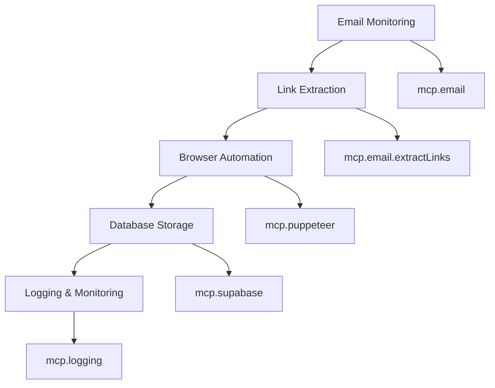
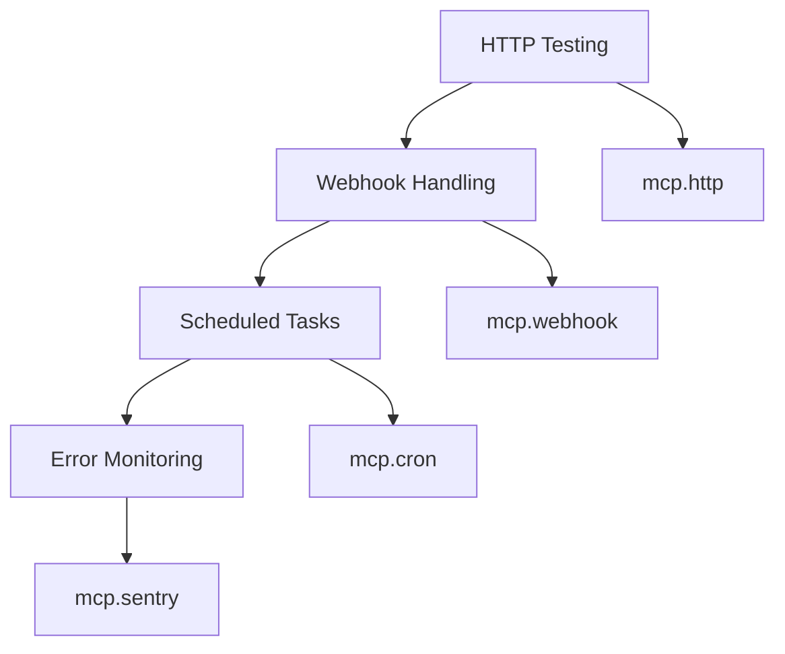
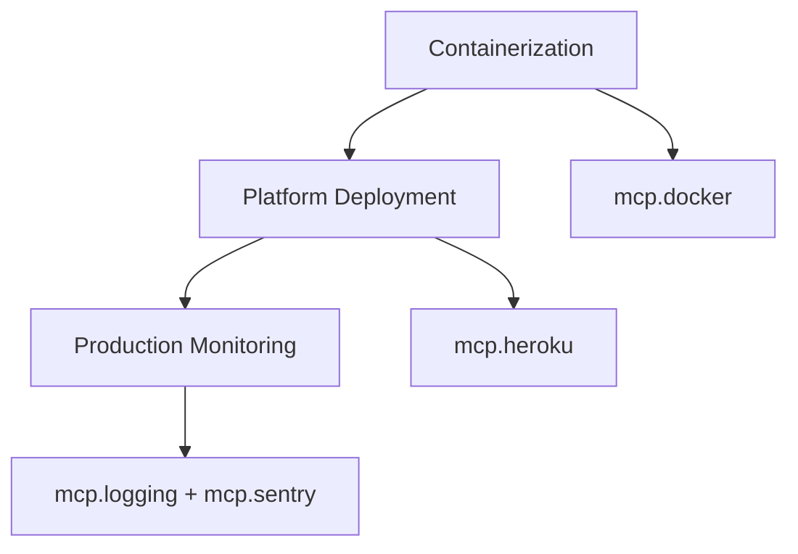

# Email Integration Project Structure with MCPs

This document outlines the project structure and how MCPs (Model Context Protocol) are organized for your email integration project with Hostinger and Puppeteer automation.

## Project Overview

```
email-integration-project/
├── 📁 MCP Configuration
│   ├── MCP_EMAIL_PROJECT_SETUP.md     # Comprehensive MCP setup guide
│   ├── mcp-config.json               # MCP configuration file
│   ├── setup-mcps.sh                 # Automated setup script
│   └── PROJECT_STRUCTURE.md          # This file
│
├── 📁 Email Integration Core
│   ├── emailClient.js                # HostingerEmailClient class
│   ├── config.js                     # Email configuration
│   ├── puppeteerEmailIntegration.js  # Puppeteer helper
│   └── automationExample.js          # Complete automation example
│
├── 📁 API Server
│   ├── emailAPI.js                   # Express API server
│   ├── routes/                       # API route handlers
│   └── middleware/                   # Express middleware
│
├── 📁 Database & Storage
│   ├── models/                       # Database models
│   ├── migrations/                   # Database migrations
│   └── seeds/                        # Database seed data
│
├── 📁 Testing & Automation
│   ├── tests/                        # Test files
│   ├── scripts/                      # Automation scripts
│   └── puppeteer/                    # Puppeteer automation files
│
├── 📁 Monitoring & Logging
│   ├── logs/                         # Application logs
│   ├── monitoring/                   # Monitoring configuration
│   └── alerts/                       # Alert configurations
│
├── 📁 Deployment
│   ├── docker/                       # Docker configuration
│   ├── kubernetes/                   # Kubernetes manifests
│   └── heroku/                       # Heroku configuration
│
└── 📁 Environment & Config
    ├── .env.template                 # Environment variables template
    ├── .env                          # Environment variables (gitignored)
    └── package.json                  # Node.js dependencies
```

## MCP Organization by Category

### 1. Core Development MCPs

**Purpose**: Essential development tools and utilities

| MCP Server           | Package                                            | Function                        |
| -------------------- | -------------------------------------------------- | ------------------------------- |
| `context7`           | `@upstash/context7-mcp`                            | Documentation and code examples |
| `sequentialthinking` | `@modelcontextprotocol/server-sequential-thinking` | Advanced problem-solving        |
| `filesystem`         | `@modelcontextprotocol/server-filesystem`          | File system access              |
| `browser`            | `@agent-infra/mcp-server-browser`                  | Web browser automation          |

### 2. Email & Communication MCPs

**Purpose**: Email operations and IMAP/SMTP integration

| MCP Server | Package            | Function                 |
| ---------- | ------------------ | ------------------------ |
| `email`    | `mcp-server-email` | General email operations |
| `imap`     | `mcp-server-imap`  | IMAP email access        |
| `smtp`     | `mcp-server-smtp`  | SMTP email sending       |

### 3. Automation & Testing MCPs

**Purpose**: Browser automation and testing workflows

| MCP Server   | Package                 | Function                      |
| ------------ | ----------------------- | ----------------------------- |
| `puppeteer`  | `mcp-server-puppeteer`  | Puppeteer browser automation  |
| `playwright` | `mcp-server-playwright` | Playwright browser automation |
| `selenium`   | `mcp-server-selenium`   | Selenium browser automation   |
| `testing`    | `mcp-server-testing`    | Testing utilities             |

### 4. Database & Storage MCPs

**Purpose**: Database operations and data persistence

| MCP Server | Package                         | Function                     |
| ---------- | ------------------------------- | ---------------------------- |
| `supabase` | `@supabase/mcp-server-supabase` | Supabase database operations |
| `postgres` | `mcp-server-postgres`           | PostgreSQL operations        |
| `redis`    | `mcp-server-redis`              | Redis cache operations       |

### 5. API & Integration MCPs

**Purpose**: HTTP requests, webhooks, and scheduled tasks

| MCP Server | Package              | Function                  |
| ---------- | -------------------- | ------------------------- |
| `http`     | `mcp-server-http`    | HTTP request handling     |
| `rest`     | `mcp-server-rest`    | REST API operations       |
| `webhook`  | `mcp-server-webhook` | Webhook handling          |
| `cron`     | `mcp-server-cron`    | Scheduled task management |

### 6. Monitoring & Logging MCPs

**Purpose**: Application monitoring and error tracking

| MCP Server | Package              | Function                      |
| ---------- | -------------------- | ----------------------------- |
| `sentry`   | `@sentry/mcp-server` | Error tracking and monitoring |
| `logging`  | `mcp-server-logging` | Application logging           |
| `metrics`  | `mcp-server-metrics` | Performance metrics           |

### 7. Deployment & Infrastructure MCPs

**Purpose**: Deployment and infrastructure management

| MCP Server   | Package                 | Function                      |
| ------------ | ----------------------- | ----------------------------- |
| `heroku`     | `@heroku/mcp-server`    | Heroku platform management    |
| `docker`     | `mcp-server-docker`     | Docker container management   |
| `kubernetes` | `mcp-server-kubernetes` | Kubernetes cluster management |
| `aws`        | `mcp-server-aws`        | AWS services management       |

## MCP Workflow Integration

### Email Verification Workflow



### API Development Workflow



### Deployment Workflow



## Environment Variables

### Required Environment Variables

```bash
# Email Configuration
EMAIL_USER=your@domain.com
EMAIL_PASSWORD=your_email_password

# Database
SUPABASE_URL=your_supabase_url
SUPABASE_ANON_KEY=your_supabase_anon_key
DATABASE_URL=your_database_url
REDIS_URL=your_redis_url

# Monitoring
SENTRY_DSN=your_sentry_dsn

# Deployment
HEROKU_API_KEY=your_heroku_api_key
AWS_ACCESS_KEY_ID=your_aws_access_key
AWS_SECRET_ACCESS_KEY=your_aws_secret_key
```

## Quick Start Commands

### 1. Setup MCPs

```bash
# Run the automated setup script
./setup-mcps.sh

# Or manually install core MCPs
npm install -g @upstash/context7-mcp
npm install -g @modelcontextprotocol/server-sequential-thinking
npm install -g @modelcontextprotocol/server-filesystem
npm install -g @agent-infra/mcp-server-browser
```

### 2. Configure Environment

```bash
# Copy environment template
cp .env.template .env

# Edit with your credentials
nano .env
```

### 3. Test Configuration

```bash
# Test MCP installation
npx -y @upstash/context7-mcp --help

# Check MCP configuration
cat ~/.cursor/mcp/config.json
```

### 4. Restart Cursor

After setting up MCPs, restart Cursor to load the new configuration.

## MCP Usage Examples

### Email Operations

```javascript
// Search emails using MCP
const emails = await mcp.email.search({
  from: "noreply@example.com",
  subject: "verification",
  limit: 5,
});

// Extract verification links
const links = await mcp.email.extractLinks(emails[0]);
```

### Puppeteer Automation

```javascript
// Launch browser and automate email verification
const browser = await mcp.puppeteer.launch({ headless: false });
const page = await browser.newPage();

// Navigate to verification link
await page.goto(verificationLink);
await mcp.puppeteer.waitForSelector(page, "#verification-code");
```

### Database Operations

```javascript
// Store email data in Supabase
await mcp.supabase.insert("emails", {
  message_id: email.messageId,
  subject: email.subject,
  from: email.from,
  received_at: email.date,
});
```

### Monitoring & Logging

```javascript
// Log email operations
await mcp.logging.info("Email verification completed", {
  email: emailAddress,
  timestamp: new Date(),
});

// Track errors with Sentry
await mcp.sentry.captureException(error);
```

## Troubleshooting

### Common Issues

1. **MCP not loading**: Restart Cursor after configuration changes
2. **Authentication errors**: Ensure environment variables are set correctly
3. **Email connection issues**: Verify Hostinger IMAP settings
4. **Puppeteer errors**: Check browser installation and permissions

### Verification Commands

```bash
# Test email MCP
npx -y mcp-server-email --help

# Test Puppeteer MCP
npx -y mcp-server-puppeteer --help

# Check MCP configuration
cat ~/.cursor/mcp/config.json

# List installed MCPs
npm list -g | grep mcp
```

## Next Steps

1. **Run Setup Script**: Execute `./setup-mcps.sh` to install and configure MCPs
2. **Configure Environment**: Set up your `.env` file with credentials
3. **Test Integration**: Verify email connection and Puppeteer automation
4. **Deploy**: Use deployment MCPs to deploy your email automation system
5. **Monitor**: Set up monitoring and logging for production use

This MCP configuration provides a comprehensive toolkit for your email integration project, enabling seamless automation, testing, and deployment workflows.
